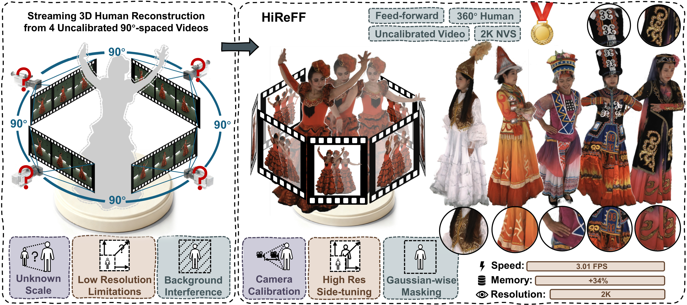
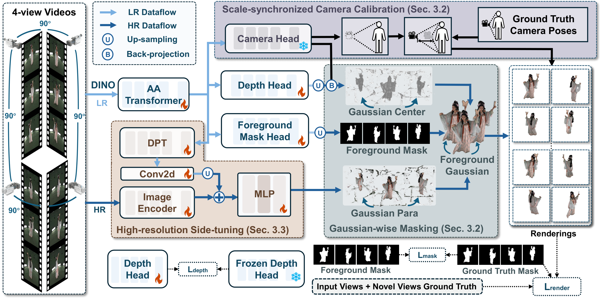

# HiReFF: High-Resolution Feedforward Human Reconstruction from Uncalibrated Sparse-View Video

<p align="center">
  <a href="ARXIV_URL"></a>
  <a href="https://iridescentjiang.github.io/HiReFF/"></a>
</p>

<p align="center">
  Official PyTorch implementation for the paper:
</p>

<p align="center">
  <strong>HiReFF: High-Resolution Feedforward Human Reconstruction from Uncalibrated Sparse-View Video</strong><br>
  <em>ECCV 2026</em>
</p>

<p align="center">
  <a href="https://scholar.google.com.hk/citations?user=gqaK3igAAAAJ&hl=zh-CN">Yiming Jiang</a><sup>&#x2606;</sup> &nbsp;
  <a href="https://scholar.google.com.hk/citations?user=0S0lNhUAAAAJ&hl=zh-CN&oi=ao">Hanzhang Tu</a> &nbsp;
  <a href="https://scholar.google.com.hk/citations?user=BDfZbbEAAAAJ&hl=zh-CN">Wenfeng Song</a> &nbsp;
  <a href="https://scholar.google.com.hk/citations?user=XBzr0pkAAAAJ&hl=zh-CN&oi=ao">Siyou Lin</a> &nbsp;
  <a href="https://scholar.google.com.hk/citations?user=s0T1w0gAAAAJ&hl=zh-CN&oi=sra">Liang An</a> &nbsp;
  <a href="https://scholar.google.com.hk/citations?user=hn0KFx8AAAAJ&hl=zh-CN">Shuai Li</a> &nbsp;
  <a href="https://research.buaa.edu.cn/en/persons/aimin-hao/">Aimin Hao</a><sup>&#x2709;</sup> &nbsp;
  <a href="https://scholar.google.com.hk/citations?user=ogXIdlYAAAAJ&hl=zh-CN">Yebin Liu</a>
</p>

> <sup>&#x2606;</sup> Work done during an internship at Tsinghua University. &nbsp; <sup>&#x2709;</sup> Corresponding author. Email: jiangyimingjym@buaa.edu.cn ham@buaa.edu.cn liuyebin@tsinghua.edu.cn



> **HiReFF** is a feed-forward method for 2K-resolution 360° human video reconstruction from uncalibrated sparse-view videos. Taking only four views separated by 90° as input, it reconstructs temporally consistent 3D Gaussians in a streaming fashion at 3.01 FPS on a single RTX 4090 GPU, and achieves 2K resolution with only 34% additional VRAM during training compared to 0.5K.

## The Pipeline of Our Method



> **HiReFF** decomposes 4D human reconstruction into two key tasks: foreground 3D Gaussian reconstruction from uncalibrated sparse-view videos and computationally efficient high-resolution synthesis. It employs Scale-synchronized Camera Calibration to resolve metric scale ambiguity, Gaussian-wise Foreground Masking to reconstruct clean foregrounds, and High-resolution Side-tuning for efficient 2K rendering.

---

##  Environment Setup

### Prerequisites

- **Python** >= 3.10
- **CUDA** >= 11.8 (required for `gsplat` Gaussian rasterizer)
- **GPU** with at least 16 GB VRAM for inference; 8 GPUs recommended for training

### Installation

```bash
git clone https://github.com/IridescentJiang/HiReFF.git
cd HiReFF

# 1. Install PyTorch first (match your CUDA version)
#    This project was developed with torch 2.5 + CUDA 11.8:
pip install torch==2.5.0 torchvision==0.20.0 --index-url https://download.pytorch.org/whl/cu118

# 2. Core install (inference + training)
pip install -e .[gsplat,train]

# Verify
python -c "from vggt import VGGT; print('Install OK')"
```

---

##  Model Inference

### Checkpoints

The model is initialised from the **VGGT-1B** pretrained weights (`facebook/VGGT-1B` on HuggingFace),
then fine-tuned on human datasets.

| Checkpoint | Description | Download |
|---|---|---|
| `checkpoint_dna_mvh_zju.pt` | Fine-tuned on DNA-Rendering + ZJU-MoCap + MVHuman | coming soon |

### Available Scripts

All inference scripts use `argparse` and share utilities in `vggt/utils/inference_utils.py`.

#### 1. Multi-view Rendering (`infer.py`)

The primary entry point. Given sparse input views, predicts Gaussians and renders novel views.

```bash
python infer.py \
    --data-root ./test_data \
    --checkpoint-path ./checkpoints/checkpoint_dna_mvh_zju.pt \
    --input-views 25,1,13,37 \
    --novel-views 1,4,7,10,13,16,19,22,25,28,31,34,37,40,43,46 \
    --output-dir output/multiview
```

#### 2. 360° Video Rendering (`infer_360_video.py`)

Generates smooth camera trajectories with Slerp or orbital interpolation between anchor views.

```bash
python infer_360_video.py \
    --data-root ./test_data \
    --checkpoint-path ./checkpoints/checkpoint_dna_mvh_zju.pt \
    --input-views 25,1,13,37 \
    --inter-views-between 4 \
    --interpolation-mode orbit \
    --output-dir output/multiview
```

#### 3. Video from Sequences (`infer_video.py`)

Processes NPZ sequences or directories of images and outputs MP4 videos with smooth trajectory interpolation.

```bash
python infer_video.py \
    --data-root ./wild_images \
    --checkpoint-path ./checkpoints/checkpoint_dna_mvh_zju.pt \
    --input-views 0,3,5,8 \
    --inter-view 30 \
    --fps 18 \
    --output-dir output/videos
```

### Input Data Format

Inference uses **NPZ files** with the following structure:

```
frame_0000.npz
  ├── view_00  (Python dict with keys: image, intrinsic, extrinsic)
  ├── view_01
  └── ...
```

Each view dict contains:
- `image` — JPEG-encoded bytes (RGB)
- `intrinsic` — 3×3 float32 camera intrinsic matrix
- `extrinsic` — 4×4 float32 camera extrinsic matrix (camera-to-world)

See [docs/data_preparation.md](docs/data_preparation.md) for details.

---

##  Model Training

### Data Preparation

Training requires NPZ files with the same structure as inference, plus a `mask` key
(PNG-encoded foreground mask). The directory layout is:

```
{data_root}/{dna-rendering,zju-mocap,mvhuman}/{subject}/frame_XXXX.npz
```

Preprocessing scripts for converting from DNA-Rendering, ZJU-MoCap, and MVHuman
datasets are provided in `preprocessing/`. See each subdirectory's `README.md`
for instructions.

A preprocessed sample dataset is available on ModelScope (link coming soon).

See [docs/data_preparation.md](docs/data_preparation.md) for the full NPZ format specification.

### Running Training

Training uses PyTorch Distributed Data Parallel (DDP) across all available GPUs.
Training starts from the **VGGT-1B** pretrained model by default, with optional
resume from a checkpoint:

```bash
# Start from VGGT-1B pretrained model (HuggingFace)
python train.py \
    --data-root /path/to/training_data \
    --epochs 10 \
    --dataset-mode mix

# Resume from a previous HiReFF checkpoint
python train.py \
    --data-root /path/to/training_data \
    --checkpoint ./checkpoints/checkpoint_dna_mvh_zju.pt \
    --epochs 10

# Single-dataset fine-tuning
python train.py \
    --data-root /path/to/data \
    --epochs 5 \
    --dataset-mode single \
    --single-dataset mvhuman
```

To control which GPUs to use:

```bash
CUDA_VISIBLE_DEVICES=0,1,2,3 python train.py --data-root /path/to/data
```

### Key Training Arguments

| Argument | Default | Description |
|---|---|---|
| `--data-root` | (required) | Root directory of training NPZ data |
| `--checkpoint` | (VGGT-1B from HuggingFace) | Checkpoint to load / resume from |
| `--epochs` | 10 | Number of training epochs |
| `--lr` | auto | Learning rate (auto-scaled by GPU count) |
| `--batch-size` | 1 per GPU | Batch size per GPU |
| `--dataset-mode` | mix | `single` or `mix` |
| `--render-mode` | gsplat | `gsplat` or `mipsplat` |
| `--master-port` | 20008 | DDP master port |

### Monitoring

```bash
tensorboard --logdir runs/
```

---

##  Project Structure

```
vggt/
  models/        — VGGT model, Aggregator (ViT + alternating attention)
  heads/         — Camera, depth, GS parameter, and mask prediction heads
  layers/        — Transformer blocks, attention, patch embedding, RoPE
  rendering/     — Gaussian splatting rendering (gsplat backend), pose interpolation
  training/      — Loss functions, LPIPS, dataset classes, training config
  utils/         — Pose encoding, geometry, depth unprojection, inference helpers
infer.py         — Primary inference entry point
infer_360_video.py — 360° multi-view rendering with camera interpolation
infer_video.py   — Video rendering from NPZ sequences or image directories
train.py         — DDP training entry point
preprocessing/   — Dataset conversion scripts (DNA / ZJU / MVHuman)
docs/            — Additional documentation
```

##  License

This project is licensed under CC BY-NC 4.0 — see [LICENSE](LICENSE) for details.

##  Citation

```bibtex
@inproceedings{jiang2026hireff,
  title     = {HiReFF: High-Resolution Feedforward Human Reconstruction from Uncalibrated Sparse-View Video},
  author    = {Yiming Jiang and Hanzhang Tu and Wenfeng Song and Siyou Lin and Liang An and Shuai Li and Aimin Hao and Yebin Liu},
  booktitle = {European Conference on Computer Vision (ECCV)},
  year      = {2026},
}
```

##  Acknowledgement

We gratefully acknowledge the authors of [VGGT](https://github.com/facebookresearch/vggt) and [AnySplat](https://github.com/AnySplat/AnySplat) for making their code publicly available. Any third-party packages are owned by their respective authors and must be used under their respective licenses.
